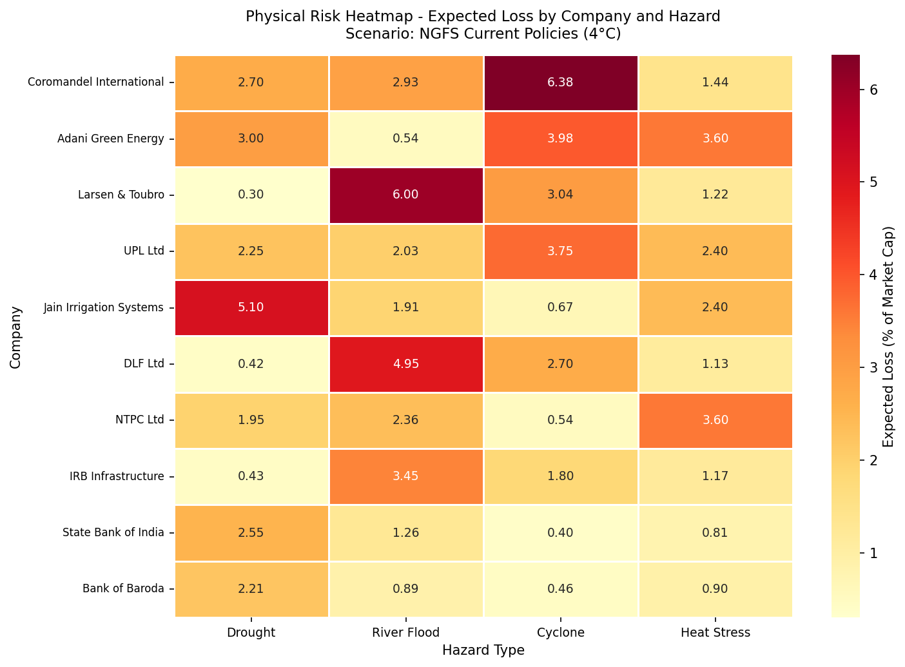
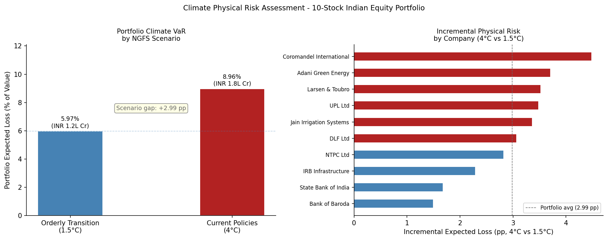

# Climate Physical Risk Quantification

**Track:** Resume A - Climate & ESG Finance  
**Status:** In-progress  
**Environment:** Python 3.12 (`resume-a`)  
**Last Updated:** 2026-05

---

## Objective

This project quantifies the physical climate risk exposure of a 10-stock Indian
equity portfolio using a TCFD-aligned expected loss framework. For each company,
asset locations are mapped to district-level hazard scores, combined with
sector-specific vulnerability factors, and aggregated to a portfolio-level Climate
VaR under two NGFS warming scenarios. The methodology reflects the approach used
by climate risk teams at rating agencies and ESG data providers for portfolio-level
physical risk screening.

---

## Data Sources

| Dataset | Source | Coverage | Notes |
|---|---|---|---|
| ThinkHazard | https://thinkhazard.org/en/ | District-level, India | Flood, drought, cyclone, heat stress ratings |
| NGFS Scenarios for Central Banks | https://www.ngfs.net | Global, 2022 | Orderly Transition and Current Policies pathways |
| IPCC AR6 Working Group II | https://www.ipcc.ch/report/ar6/wg2/ | Global | Vulnerability coefficients by sector and hazard |
| NSE Annual Reports | https://www.nseindia.com | Company-level | Asset location mapping for each stock |
| CLIMADA ETH Documentation | https://climada-python.readthedocs.io | Global | Supporting reference for vulnerability ranges |

---

## Methodology

### Framework
The analysis follows the TCFD physical risk framework. Physical risk is assessed
using a three-factor expected loss model:

```
Expected Loss = Asset Value x Hazard Probability x Vulnerability Factor
```

Transition risk is excluded from scope.

### Portfolio
Ten Indian equities spanning six sectors: agriculture inputs (UPL, Coromandel
International), power generation (NTPC, Adani Green Energy), infrastructure
(L&T, IRB Infrastructure), banking with agricultural credit exposure (SBI, Bank
of Baroda), irrigation (Jain Irrigation), and coastal real estate (DLF).

### Asset Location Mapping
Each company's primary assets are mapped to districts using NSE annual report
disclosures. Companies with geographically distributed assets are represented by
multiple district entries weighted by estimated revenue or asset share. The
portfolio covers 25 districts across 10 Indian states.

### Hazard Scoring
District-level hazard ratings for river flood, drought, tropical cyclone, and
heat stress are sourced from ThinkHazard (GFDRR/World Bank). Qualitative ratings
are converted to annual exceedance probability proxies: High = 0.20, Medium = 0.10,
Low = 0.05, Very Low = 0.01.

### Scenario Adjustment
Under the NGFS Current Policies (4°C) pathway, hazard probabilities are scaled
by 1.5x relative to the Orderly Transition (1.5°C) baseline, consistent with
NGFS documentation on South Asian extreme event frequency under high-emission
pathways. This scalar is applied uniformly across all hazard types as a
conservative approximation.

### Vulnerability Factors
Sector-hazard vulnerability factors (fraction of asset value lost given hazard
occurs) are assigned using IPCC AR6 WG2 sector chapters and CLIMADA documentation.
Banking sector factors represent the second-order credit transmission channel:
physical hazards impair agricultural borrowers, raising NPA ratios and reducing
bank revenue.

### Aggregation
Expected loss is aggregated from location level to company level (weighted by
asset share) and to portfolio level (equal-weighted, 10% per company). The
portfolio metric is annual expected loss as a percentage of total portfolio value.

---

## Results

**Portfolio Climate VaR - Orderly Transition (1.5°C): 5.97% of portfolio value**  
**Portfolio Climate VaR - Current Policies (4°C): 8.96% of portfolio value**  
**Incremental risk (scenario gap): 2.99 pp**





### Scenario Comparison Table

| Company | Sector | Orderly Transition EL (%) | Current Policies EL (%) | Incremental Risk (pp) |
|---|---|---|---|---|
| Coromandel International | Agriculture Inputs | 8.96 | 13.44 | 4.48 |
| Adani Green Energy | Power Generation | 7.41 | 11.12 | 3.71 |
| Larsen & Toubro | Infrastructure | 7.04 | 10.56 | 3.52 |
| UPL Ltd | Agriculture Inputs | 6.95 | 10.43 | 3.48 |
| Jain Irrigation Systems | Irrigation / Water | 6.72 | 10.08 | 3.36 |
| DLF Ltd | Real Estate (Coastal) | 6.13 | 9.19 | 3.06 |
| NTPC Ltd | Power Generation | 5.64 | 8.45 | 2.82 |
| IRB Infrastructure | Infrastructure | 4.57 | 6.85 | 2.28 |
| State Bank of India | Banking (Agri Credit) | 3.34 | 5.02 | 1.68 |
| Bank of Baroda | Banking (Agri Credit) | 2.98 | 4.46 | 1.49 |

Key findings:
- Agriculture inputs sector carries the highest physical risk exposure, driven by
  coastal Andhra Pradesh location and combined drought-cyclone hazard profile
- Adani Green Energy ranks second - renewable energy assets in Gujarat's cyclone
  belt are not inherently low physical risk, contrary to common assumption
- Banking sector exposures are lowest, consistent with their second-order credit
  channel exposure rather than direct asset damage
- The 2.99 pp scenario gap represents the quantifiable cost of divergence between
  a managed transition and a high-emission pathway

---

## Limitations

- ThinkHazard ratings are qualitative district-level classes; a rigorous
  implementation would use return-period curves from CMIP6 or IMD gridded data
- Vulnerability factors are point estimates, not continuous damage functions
  mapping hazard intensity to loss fraction
- The 1.5x scenario scalar is a uniform approximation; CMIP6 outputs show
  hazard-specific and region-specific multipliers that vary from this estimate
- Company losses are treated as independent; loss correlation during systemic
  climate events would increase portfolio tail losses above expected loss estimates
- Transition risk is excluded; a complete TCFD assessment requires both physical
  and transition risk components
- Market capitalisation is used as asset value proxy; replacement value or insured
  value would be more appropriate for physical damage estimation
- Asset locations are sourced from annual report disclosures, which are
  self-reported and may lag or incompletely represent geographic asset distribution

---

## References

- TCFD Technical Supplement on Climate Scenario Analysis (2017):
  https://assets.bbhub.io/company/sites/60/2021/03/FINAL-TCFD-Technical-Supplement-062917.pdf
- NGFS Scenarios for Central Banks and Supervisors (2022):
  https://www.ngfs.net/sites/default/files/medias/documents/ngfs_scenarios_for_central_banks_and_supervisors.pdf
- IPCC AR6 Working Group II (2022): https://www.ipcc.ch/report/ar6/wg2/
- ThinkHazard, GFDRR/World Bank: https://thinkhazard.org/en/
- CLIMADA Platform, ETH Zurich: https://climada-python.readthedocs.io
